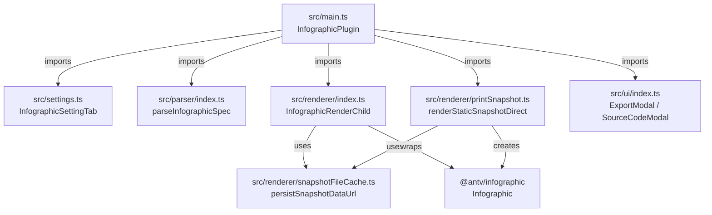

# PROJECT KNOWLEDGE BASE

**Generated:** 2026-06-27
**Branch:** master
**Version:** 0.1.8

## Project Overview

Obsidian plugin that renders [AntV Infographic](https://github.com/antvis/Infographic) visualizations from fenced `infographic` code blocks. It integrates the `@antv/infographic` library into Obsidian's markdown preview, supporting both JSON configuration and AntV's declarative DSL, with live rendering, responsive resizing, toolbar actions (copy/export), and PDF-export compatibility via static snapshots.

## Repo Structure

```
./
├── src/                              # TypeScript source (DO NOT edit main.js directly)
│   ├── main.ts                       # Plugin entry: lifecycle, commands, code-block processor
│   ├── settings.ts                   # Settings schema + settings tab UI
│   ├── parser/
│   │   ├── InfographicParser.ts      # JSON / DSL validation
│   │   └── index.ts                  # Parser barrel exports
│   ├── renderer/
│   │   ├── InfographicView.ts        # Live AntV rendering + ResizeObserver
│   │   ├── printSnapshot.ts          # Static snapshot generation for PDF export
│   │   ├── snapshotFileCache.ts      # Vault file persistence for snapshot data URLs
│   │   └── index.ts                  # Renderer barrel exports
│   └── ui/
│       ├── ExportModal.ts            # PNG/SVG export modal
│       ├── SourceModal.ts            # Source-code viewer modal
│       └── index.ts                  # UI barrel exports
├── skills/obsidian-infographic/      # Agent skill for OhMyOpenCode
│   ├── SKILL.md                      # Skill definition + quick reference
│   └── reference/
│       └── infographic-creator.md    # Full syntax spec, templates, examples
├── styles.css                        # Plugin styles (toolbar, print, modals, loading)
├── esbuild.config.mjs                # esbuild bundle config (dev watch + prod build)
├── eslint.config.mts                 # ESLint flat config (typescript-eslint + obsidianmd)
├── tsconfig.json                     # TypeScript compiler options
├── version-bump.mjs                  # Syncs package.json version → manifest.json + versions.json
├── manifest.json                     # Obsidian plugin metadata
├── versions.json                     # Obsidian version compatibility map
├── main.js                           # Generated bundle (DO NOT EDIT)
├── README.md                         # English user docs
├── README_CN.md                      # Chinese user docs
├── LICENSE                           # Apache-2.0
└── AGENTS.md                         # This file
```

## Tech Stack

| Layer | Technology | Role |
|-------|------------|------|
| Language | TypeScript 5.9 | Strict TS with `strictNullChecks`, `noUncheckedIndexedAccess` |
| Runtime | Node.js 20.x / 22.x | CI matrix; ES modules (`"type": "module"`) |
| Plugin host | Obsidian API `^1.13.1` | Markdown code-block processor, modals, settings |
| Visualization | `@antv/infographic` `^0.2.19` | SVG/canvas infographic rendering |
| Bundler | esbuild 0.28.1 | Dev watch + production CJS bundle to `main.js` |
| Lint | typescript-eslint 8.62 + eslint-plugin-obsidianmd 0.1.9 | Type-aware lint for Obsidian plugin rules |
| Build orchestration | npm scripts (`package.json`) | `dev`, `build`, `lint`, `version` |

## Development Commands

| Task | Command | Notes |
|------|---------|-------|
| Install | `npm install` | Standard npm install |
| Dev build | `npm run dev` | esbuild watch mode with inline sourcemaps |
| Production build | `npm run build` | `tsc -noEmit -skipLibCheck` then `esbuild` production bundle |
| Lint | `npm run lint` | `eslint .` (ignores `main.js`, `node_modules`, generated configs) |
| Typecheck | `npm run build` | `tsc -noEmit` runs first as part of build |
| Version bump | `npm run version [patch\|minor\|major]` | Updates `manifest.json` + `versions.json`, stages them |

## Architecture

### Module Relationship



### Data Flow: Code Block → Rendered SVG/PNG

```mermaid
flowchart LR
    A["Markdown preview<br/>```infographic block"] -->|source string| B["src/parser/InfographicParser.ts"]
    B -->|ParseResult<br/>{content, isJson}| C["src/main.ts<br/>processInfographicBlock"]
    C -->|PDF mode?| D["src/renderer/printSnapshot.ts<br/>renderStaticSnapshotDirect"]
    D -->|off-screen Infographic| E["targetEl &lt;img&gt;<br/>data URL / persisted file"]
    C -->|normal mode| F["src/renderer/InfographicView.ts<br/>InfographicRenderChild"]
    F -->|live render| G["DOM SVG/canvas"]
    F -->|toDataURL png/svg| H["print snapshot &lt;img&gt;"]
    H -->|persist| I["src/renderer/snapshotFileCache.ts<br/>vault print-cache"]
    F -->|resize| J["ResizeObserver<br/>update width/height"]
```

### Key Responsibilities

| Module | Responsibility |
|--------|----------------|
| `src/main.ts` | Plugin lifecycle, code-block processor registration, commands, error handling, orchestrates print vs. normal render paths. |
| `src/settings.ts` | Settings schema (`autoRender`, `theme`, `errorBehavior`) and Obsidian settings tab UI. |
| `src/parser/InfographicParser.ts` | Validates source as either valid JSON (if starts with `{`) or passes DSL through as plain text. |
| `src/renderer/InfographicView.ts` | Live `InfographicRenderChild` wrapper; handles loading, resize, aspect ratio from SVG viewBox, and schedules print snapshots. |
| `src/renderer/printSnapshot.ts` | Static snapshot generation for PDF export, DOM extraction fallback, and `beforeprint` refresh. |
| `src/renderer/snapshotFileCache.ts` | Persists data URLs to vault files via `app.vault.adapter`, returning `app.vault.adapter.getResourcePath`. |
| `src/ui/ExportModal.ts` | Modal to export the current live infographic as PNG or SVG. |
| `src/ui/SourceModal.ts` | Modal to view (and copy) the original block source, with JSON formatting. |

## Coding Conventions

- **Strict TypeScript**: `strictNullChecks`, `noUncheckedIndexedAccess`, `strictBindCallApply`, `useUnknownInCatchVariables` enabled.
- **Imports**: Prefer `import` from `obsidian` API and `@antv/infographic`; barrel `index.ts` files group module exports.
- **Module resolution**: `baseUrl: "src"` in `tsconfig.json`; use relative imports inside `src/` (e.g., `../settings`).
- **DOM lifecycle**: All rendering delegated to `MarkdownRenderChild` subclasses; never put DOM construction directly in `main.ts`.
- **Event registration**: Always use `this.registerEvent()` or `this.registerDomEvent()` so Obsidian cleans up on plugin unload.
- **Error handling**: Use `e instanceof Error ? e.message : String(e)` for unknown errors; catch-and-ignore is acceptable for cleanup paths (commented).
- **Naming**: PascalCase for classes/types, camelCase for functions/variables, kebab-case for CSS classes.
- **CSS**: BEM-ish naming with `infographic-` prefix; print styles duplicated under `@media print` and `.print` class for Electron compatibility.
- **Bundle**: `main.js` is generated by esbuild; externalize `obsidian`, `electron`, and `@codemirror/*`.

## Testing

No automated tests exist in this repository. The project relies on:

- `npm run build` for TypeScript type checking (`tsc -noEmit`).
- `npm run lint` for static analysis.
- Manual verification in Obsidian for preview rendering, export, and PDF behavior.

If adding tests, prefer a Node-based test runner compatible with ESM TypeScript (e.g., Vitest) and add a `test` script to `package.json`.

## CI/CD

| Workflow | File | Trigger | Jobs |
|----------|------|---------|------|
| Lint / Build | `.github/workflows/lint.yml` | Push and PR to any branch | `npm ci` → `npm run build` → `npm run lint` on Node 20.x and 22.x matrix. |
| Release | `.github/workflows/release.yml` | Tag push (`*`) | `npm ci` → `npm run build`; creates GitHub release with `main.js`, `manifest.json`, `styles.css`. Tags containing `-preview.` are published as pre-releases. |

### Release Process

1. Ensure `manifest.json` version matches the intended tag.
2. Run `npm run build`.
3. Commit changes.
4. Create and push tag (no `v` prefix): `git tag -a 0.1.9 -m "Release 0.1.9" && git push origin 0.1.9`.
5. GitHub Actions creates the release automatically.

Use `npm run version [patch|minor|major]` to bump `package.json`, which `version-bump.mjs` syncs into `manifest.json` and `versions.json`.

## Gotchas

- **Never edit `main.js` directly**; it is regenerated by `npm run build`. Edit `src/` only.
- **PDF export has two paths**: direct `renderStaticSnapshotDirect` when `.print` is detected, plus a hidden `.infographic-print` snapshot in normal mode that is refreshed by `beforeprint` and `ResizeObserver`-driven timers.
- **Snapshot persistence is best-effort**: `persistSnapshotDataUrl` may fail silently; the data URL remains the primary render source.
- **AntV `Infographic` lifecycle**: `destroy()` is wrapped in `try/catch` because it may throw if already destroyed.
- **Popout-window compatibility**: Source code uses `activeWindow` (provided by Obsidian) instead of the global `window`/`document` for timers, DOM creation, and dark-mode checks. This keeps the plugin working in Obsidian popout windows where the global window/document may differ from the active pane.
- **Aspect ratio**: Derived from the rendered SVG `viewBox` or bounding rect; defaults to `4/3` before first render.
- **Error behavior**: `show-code` (default) renders the source block; `show-error` shows only the error with a "View details" button; `hide` empties the element.
- **Settings no longer include `maxWidth`/`maxHeight`**: those keys were removed from `InfographicSettings`; the README still mentions them but the code does not use them. Width is driven by container size and aspect ratio.
- **Dev-only dependency vulnerabilities**: `npm audit` may flag transitive dev-only packages (e.g., from `eslint-plugin-obsidianmd`). These are not shipped in the plugin bundle and can be left as-is; only runtime dependencies bundled into `main.js` affect user security.

## Agent Guidelines

### Do

- Rebuild `main.js` with `npm run build` after any source change.
- Run `npm run lint` and `npm run build` before committing.
- Use `InfographicRenderChild` for any new live-render behavior.
- Register events with `this.registerEvent()` / `this.registerDomEvent()` in `main.ts`.
- Persist snapshot data URLs via `snapshotFileCache.ts` if adding new export paths.
- Update `manifest.json` and `versions.json` via `version-bump.mjs` (or `npm run version`) when changing versions.
- Update `skills/obsidian-infographic/reference/infographic-creator.md` if new AntV templates are exposed.

### Don't

- Edit `main.js` by hand.
- Bypass `InfographicRenderChild` to render directly into the preview DOM from `main.ts`.
- Leave events unregistered; this causes memory leaks.
- Add new dependencies without confirming `npm run build` and `npm run lint` still pass.
- Treat README/AGENTS as code truth when they contradict source; the source is the source of truth (e.g., `maxWidth`/`maxHeight` settings are not in code).
