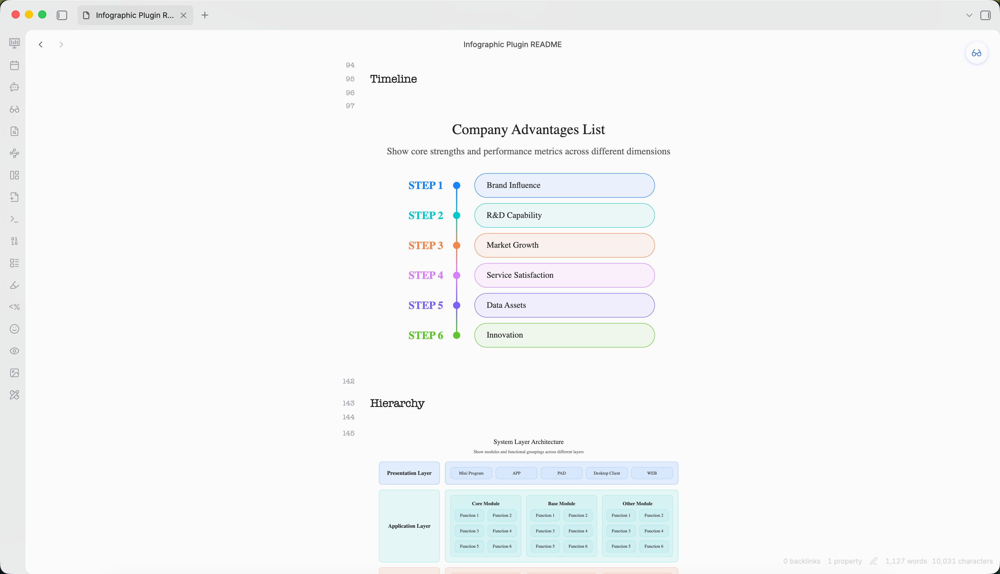

<h1 align="center">📊 Obsidian Infographic Plugin</h1>

<p align="center">
  <a href="README_CN.md">简体中文</a> ·
  <a href="README.md">English</a>
</p>

<p align="center">
  
  
  
  
</p>



Render [AntV Infographic](https://github.com/antvis/Infographic) visualizations directly in your Obsidian notes using fenced code blocks. ✨

## ✨ Features

- 🎨 **200+ Built-in Templates** - Process flows, timelines, hierarchies, charts, and more
- 📝 **Dual Syntax Support** - Use JSON configuration or AntV's declarative DSL
- 🖼️ **PDF Support** - Fully compatible with Obsidian's Export to PDF feature
- 🌓 **Theme Support** - Auto-detect or force light/dark mode
- 📐 **Responsive Design** - Automatic resize handling
- 🔄 **Live Reload** - Refresh all infographics with a single command

## 📦 Installation

### 🧪 Install via BRAT (Beta)

For beta/development versions, install using [BRAT](https://github.com/TfTHacker/obsidian42-brat):

1. Install [BRAT](https://github.com/TfTHacker/obsidian42-brat) from Community Plugins
2. Go to **Settings** → **BRAT** → **Add Beta Plugin**
3. Enter the repository URL:
   ```
   https://github.com/shuuul/obsidian-infographic
   ```
4. BRAT will download and keep the plugin updated
5. Enable **Infographic** from Community Plugins

### From Obsidian Community Plugins

1. Open **Settings** → **Community plugins**
2. Search for "Infographic"
3. Select **Install**, then **Enable**

### Manual Installation

1. Download the latest release from [GitHub Releases](https://github.com/shuuul/obsidian-infographic/releases):
   - `main.js`
   - `manifest.json`
   - `styles.css`
2. Create folder: `Vault/.obsidian/plugins/obsidian-infographic/`
3. Place the downloaded files in the folder
4. Reload Obsidian and enable the plugin

## 🚀 Usage

Create an infographic using a fenced code block with the `infographic` language:

### JSON Format

```infographic
{
  "template": "list-row-simple-horizontal-arrow",
  "data": {
    "items": [
      { "label": "Step 1", "desc": "Start" },
      { "label": "Step 2", "desc": "In Progress" },
      { "label": "Step 3", "desc": "Complete" }
    ]
  }
}
```

### DSL Format

```infographic
infographic list-row-simple-horizontal-arrow
data
  items
    - label Step 1
      desc Start
    - label Step 2
      desc In Progress
    - label Step 3
      desc Complete
```

## 📋 Template Examples

### Timeline

```infographic
infographic sequence-timeline-rounded-rect-node
data
  title Company Advantages List
  desc Show core strengths and performance metrics across different dimensions
  items
    - label Brand Influence
      value 85
      desc Strong recognition and trust among target users
      time 2021
      icon mingcute/diamond-2-fill
      illus creative-experiment
    - label R&D Capability
      value 90
      desc Proprietary core systems with continuous innovation
      time 2022
      icon mingcute/code-fill
      illus code-thinking
    - label Market Growth
      value 78
      desc Rapid user base growth in the past year
      time 2023
      icon mingcute/wallet-4-line
      illus business-analytics
    - label Service Satisfaction
      value 88
      desc High ratings for overall service system
      time 2020
      icon mingcute/happy-line
      illus feeling-happy
    - label Data Assets
      value 92
      desc Complete user tagging and profiling system
      time 2022
      icon mingcute/user-4-line
      illus mobile-photos
    - label Innovation
      value 83
      desc New product launches exceed industry average
      time 2023
      icon mingcute/rocket-line
      illus creativity
theme light
  palette antv
```

### Hierarchy

```infographic
infographic hierarchy-structure
data
  title System Layer Architecture
  desc Show modules and functional groupings across different layers
  items
    - label Presentation Layer
      children
        - label Mini Program
        - label APP
        - label PAD
        - label Desktop Client
        - label WEB
    - label Application Layer
      children
        - label Core Module
          children
            - label Function 1
            - label Function 2
            - label Function 3
            - label Function 4
            - label Function 5
            - label Function 6
        - label Base Module
          children
            - label Function 1
            - label Function 2
            - label Function 3
            - label Function 4
            - label Function 5
            - label Function 6
        - label Other Module
          children
            - label Function 1
            - label Function 2
            - label Function 3
            - label Function 4
            - label Function 5
            - label Function 6
    - label Platform Layer
      children
        - label Module 1
          children
            - label Function 1
            - label Function 2
            - label Function 3
            - label Function 4
        - label Module 2
          children
            - label Function 1
            - label Function 2
            - label Function 3
            - label Function 4
        - label Module 3
          children
            - label Function 1
            - label Function 2
            - label Function 3
            - label Function 4
theme light
  palette antv
```

### Comparison

```infographic
infographic compare-binary-horizontal-badge-card-fold
data
  title Company Strengths vs Weaknesses
  desc Present core strengths and areas for improvement in the market
  items
    - label Strengths
      children
        - label Strong R&D
          desc Technology leadership with independent innovation
        - label High Customer Retention
          desc Over 60% repurchase rate, good reputation
        - label Complete Service System
          desc Fast after-sales response, high satisfaction
    - label Weaknesses
      children
        - label Weak Brand Exposure
          desc Insufficient marketing, awareness needs improvement
        - label Limited Channel Coverage
          desc Incomplete online channel layout
        - label High Operating Costs
          desc Labor and logistics costs above industry average
theme light
  palette antv
```

### Chart

```infographic
infographic chart-bar-plain-text
data
  title Annual Revenue Growth
  desc Compare recent three years and current year targets (unit: 100M yuan)
  items
    - label 2021
      value 120
      desc Initial transformation, steady exploration
      icon lucide/sprout
    - label 2022
      value 150
      desc Platform optimization, significant efficiency gains
      icon lucide/zap
    - label 2023
      value 190
      desc Deep digital integration, comprehensive growth
      icon lucide/brain-circuit
    - label 2024
      value 240
      desc Expand ecosystem collaboration, aim for new highs
      icon lucide/trophy
theme light
  palette antv
```


## ⚙️ Configuration

Access settings via **Settings** → **Community plugins** → **Infographic**.

| Setting | Description | Default |
|---------|-------------|---------|
| **Auto render** | Automatically render in preview mode | `true` |
| **Theme** | Auto / Light / Dark | `auto` |
| **Error behavior** | show-code / show-error / hide | `show-code` |
| **Max width** | Maximum width (px) | `800` |
| **Max height** | Maximum height (px) | `600` |

### Toolbar Actions

Each rendered infographic shows a toolbar:
- **Copy** - Copy source code to clipboard
- **Export** - Save as SVG or PNG
- **PDF Export** - Compatible with Obsidian's built-in Export to PDF

## 🤖 Agent Skill

This plugin is also available as an **Agent Skill** for creating AntV Infographic visualizations in Obsidian.

### Skill Location

```
skills/obsidian-infographics/
├── SKILL.md              # Skill definition and usage guide
└── reference/
    └── GALLERY.md        # Complete template catalog with examples
```

### Usage in Agents

When used as a skill, AI agents can generate AntV Infographic visualizations by outputting `infographic` code blocks in Obsidian markdown:

```infographic
infographic list-row-simple-horizontal-arrow
data
  items
    - label Step 1
      desc Start
    - label Step 2
      desc In Progress
    - label Step 3
      desc Complete
```

### Available Templates (200+)

| Category       | Templates                                                                                          |
| -------------- | -------------------------------------------------------------------------------------------------- |
| **Lists**      | list-row-simple-horizontal-arrow, list-row-simple-horizontal, list-column, list-grid, list-pyramid |
| **Sequences**  | sequence-horizontal, sequence-timeline, sequence-roadmap, sequence-steps                           |
| **Comparison** | compare-binary, compare-swot                                                                       |
| **Hierarchy**  | hierarchy-tree, hierarchy-structure                                                                |
| **Charts**     | chart-bar, chart-column, chart-line, chart-pie                                                     |
| **Quadrant**   | quadrant-simple, quadrant-quarter                                                                  |
| **Relations**  | relation-circle, relation-dagre                                                                    |

See [Template Gallery](skills/obsidian-infographics/reference/GALLERY.md) for complete examples.

## 🛠️ Development

```bash
# Install dependencies
npm install

# Development build (watch mode)
npm run dev

# Production build
npm run build

# Lint
npm run lint
```

## 📄 License

Licensed under the Apache License, Version 2.0. See [LICENSE](LICENSE) for details.