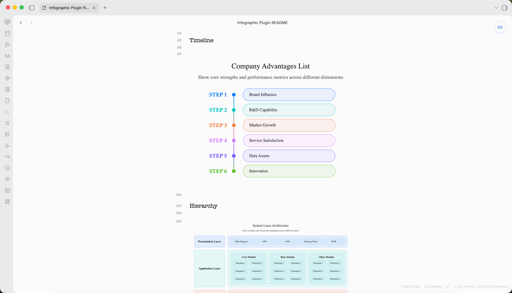

<h1 align="center">📊 Obsidian 信息图表插件</h1>

<p align="center">
  <a href="README_CN.md">简体中文</a> ·
  <a href="README.md">English</a>
</p>

<p align="center">
  
  
  
  
</p>



在 Obsidian 笔记中直接渲染 [AntV Infographic](https://github.com/antvis/Infographic) 可视化图表，使用 fenced 代码块。✨

## ✨ 功能特性

- 🎨 **200+ 内置模板** - 流程图、时间线、层次结构、图表等
- 📝 **双语法支持** - 使用 JSON 配置或 AntV 声明式 DSL
- 🖼️ **PDF 支持** - 完全兼容 Obsidian 内置的导出为 PDF 功能
- 🌓 **主题支持** - 自动检测或强制亮/暗色模式
- 📐 **响应式设计** - 自动调整大小
- 🔄 **实时刷新** - 单个命令刷新所有信息图表

## 📦 安装

### 🔌 通过 Obsidian 官方社区插件安装（推荐）

你现在可以直接从 Obsidian 官方社区插件商店搜索并安装该插件，无需使用 BRAT：

1. 打开 Obsidian 的 **设置** → **社区插件**。
2. 点击 **浏览** 并搜索 `Infographic`（或者访问 [社区插件页面](https://community.obsidian.md/plugins/infographic)）。
3. 点击 **安装**，然后 **启用**。

### 🧪 通过 BRAT 安装（测试版）

使用 [BRAT](https://github.com/TfTHacker/obsidian42-brat) 安装测试版/开发版：

1. 从社区插件安装 [BRAT](https://github.com/TfTHacker/obsidian42-brat)
2. 进入 **设置** → **BRAT** → **添加测试插件**
3. 输入仓库 URL：
   ```
   https://github.com/shuuul/obsidian-infographic
   ```
4. BRAT 将下载并保持插件更新
5. 从社区插件中启用 **Infographic**


## 🚀 使用方法

使用 `infographic` 语言创建信息图表：

### JSON 格式

```infographic
{
  "template": "list-row-simple-horizontal-arrow",
  "data": {
    "items": [
      { "label": "步骤 1", "desc": "开始" },
      { "label": "步骤 2", "desc": "进行中" },
      { "label": "步骤 3", "desc": "完成" }
    ]
  }
}
```

### DSL 格式

```infographic
infographic list-row-simple-horizontal-arrow
data
  items
    - label 步骤 1
      desc 开始
    - label 步骤 2
      desc 进行中
    - label 步骤 3
      desc 完成
```

## 📋 模板示例

### 时间线

```infographic
infographic sequence-timeline-rounded-rect-node
data
  title 企业优势列表
  desc 展示企业在不同维度上的核心优势与表现值
  items
    - label 品牌影响力
      value 85
      desc 在目标用户群中具备较强认知与信任度
      time 2021
      icon mingcute/diamond-2-fill
      illus creative-experiment
    - label 技术研发力
      value 90
      desc 拥有自研核心系统与持续创新能力
      time 2022
      icon mingcute/code-fill
      illus code-thinking
    - label 市场增长快
      value 78
      desc 近一年用户规模实现快速增长
      time 2023
      icon mingcute/wallet-4-line
      illus business-analytics
    - label 服务满意度
      value 88
      desc 用户对服务体系整体评分较高
      time 2020
      icon mingcute/happy-line
      illus feeling-happy
    - label 数据资产全
      value 92
      desc 构建了完整用户标签与画像体系
      time 2022
      icon mingcute/user-4-line
      illus mobile-photos
    - label 创新能力强
      value 83
      desc 新产品上线频率高于行业平均
      time 2023
      icon mingcute/rocket-line
      illus creativity
theme light
  palette antv
```

### 层次结构

```infographic
infographic hierarchy-structure
data
  title 系统分层结构
  desc 展示不同层级的模块与功能分组
  items
    - label 展现层
      children
        - label 小程序
        - label APP
        - label PAD
        - label 客户端
        - label WEB
    - label 应用层
      children
        - label 核心模块
          children
            - label 功能1
            - label 功能2
            - label 功能3
            - label 功能4
            - label 功能5
            - label 功能6
        - label 基础模块
          children
            - label 功能1
            - label 功能2
            - label 功能3
            - label 功能4
            - label 功能5
            - label 功能6
        - label 其他模块
          children
            - label 功能1
            - label 功能2
            - label 功能3
            - label 功能4
            - label 功能5
            - label 功能6
    - label 平台层
      children
        - label 模块1
          children
            - label 功能1
            - label 功能2
            - label 功能3
            - label 功能4
        - label 模块2
          children
            - label 功能1
            - label 功能2
            - label 功能3
            - label 功能4
        - label 模块3
          children
            - label 功能1
            - label 功能2
            - label 功能3
            - label 功能4
theme light
  palette antv
```

### 对比

```infographic
infographic compare-binary-horizontal-badge-card-fold
data
  title 企业优劣势对比
  desc 呈现企业当前在市场中的核心优势与待改善劣势
  items
    - label 优势
      children
        - label 产品研发强
          desc 技术领先，具备自主创新能力
        - label 客户粘性高
          desc 用户复购率超60%，口碑良好
        - label 服务体系完善
          desc 售后服务响应快，客户满意度高
    - label 劣势
      children
        - label 品牌曝光弱
          desc 市场宣传不足，认知度待提升
        - label 渠道覆盖窄
          desc 线上渠道布局不全，触达受限
        - label 运营成本高
          desc 人力与物流成本高于行业均值
theme light
  palette antv
```

### 图表

```infographic
infographic chart-bar-plain-text
data
  title 年度营收增长
  desc 展示近三年及本年目标营收对比（单位：亿元）
  items
    - label 2021年
      value 120
      desc 转型初期，稳步试水
      icon lucide/sprout
    - label 2022年
      value 150
      desc 平台优化，效率显著提升
      icon lucide/zap
    - label 2023年
      value 190
      desc 深化数智融合，全面增长
      icon lucide/brain-circuit
    - label 2024年
      value 240
      desc 拓展生态协同，冲击新高
      icon lucide/trophy
theme light
  palette antv
```

## ⚙️ 配置

通过 **设置** → **社区插件** → **Infographic** 访问设置。

| 设置 | 描述 | 默认值 |
|---------|-------------|---------|
| **自动渲染** | 在预览模式中自动渲染 | `true` |
| **主题** | 自动 / 亮色 / 暗色 | `auto` |
| **错误行为** | show-code / show-error / hide | `show-code` |

### 工具栏操作

每个渲染的信息图表显示一个工具栏：
- **复制** - 将源代码复制到剪贴板
- **导出** - 保存为 SVG 或 PNG
- **PDF 导出** - 兼容 Obsidian 内置的导出为 PDF 功能

## 🤖 Agent 技能

此插件也可作为 **Agent 技能**使用，用于在 Obsidian 中创建 AntV 信息图表可视化。

### 技能位置

```
skills/obsidian-infographic/
├── SKILL.md              # 技能定义和使用指南
└── reference/
    └── infographic-creator.md  # 完整语法规范、模板和示例
```

### 在 Agent 中的使用

作为技能使用时，AI Agent 可以通过在 Obsidian markdown 中输出 `infographic` 代码块来生成 AntV 信息图表可视化：

```infographic
{
  "template": "list-row-simple-horizontal-arrow",
  "data": {
    "items": [
      { "label": "步骤 1", "desc": "开始" },
      { "label": "步骤 2", "desc": "进行中" },
      { "label": "步骤 3", "desc": "完成" }
    ]
  }
}
```

### 可用模板（200+）

| 类别 | 模板 |
|----------|-----------|
| **列表** | list-row-simple-horizontal-arrow, list-row-simple-horizontal, list-column, list-grid, list-pyramid |
| **序列** | sequence-horizontal, sequence-timeline, sequence-roadmap, sequence-steps |
| **对比** | compare-binary, compare-swot |
| **层次结构** | hierarchy-tree, hierarchy-structure |
| **图表** | chart-bar, chart-column, chart-line, chart-pie |
| **象限** | quadrant-simple, quadrant-quarter |
| **关系** | relation-circle, relation-dagre |

查看[模板参考](skills/obsidian-infographic/reference/infographic-creator.md)获取完整示例。

## 🛠️ 开发

```bash
# 安装依赖
npm install

# 开发构建（监听模式）
npm run dev

# 生产构建
npm run build

# 代码检查
npm run lint
```

## 📄 许可证

根据 Apache License 2.0 授权。详情请参阅 [LICENSE](LICENSE)。

---

[English](README.md) | 简体中文
